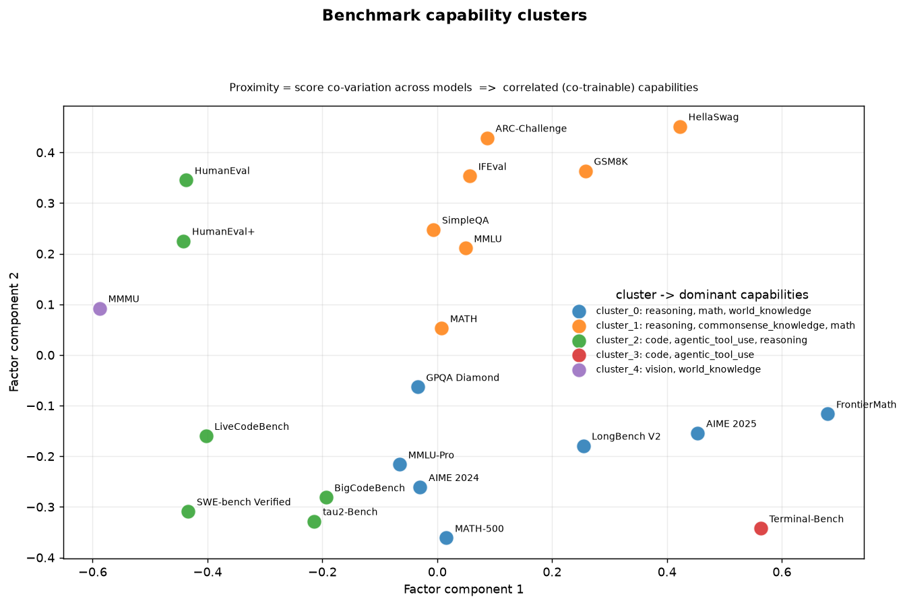
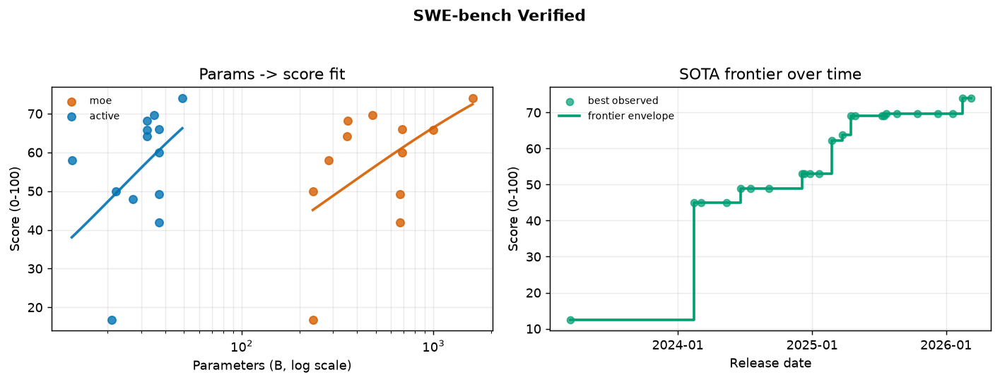
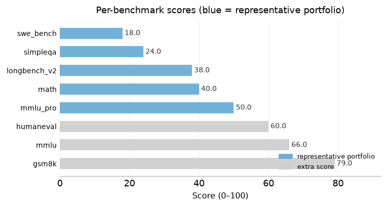

# benchmark-diagnosis

一站式大模型评测 + benchmark 低分归因诊断 + 优化建议系统。

围绕一个 LLM 模型（无论你只有**推理服务 IP**，还是只有**权重文件**），系统自动完成三件事：

1. **评测**：桥接业界标准评测工具，跑一组经过"能力覆盖分析"精选的 benchmark；
2. **诊断**：判断每个能力簇"是否不及预期"，并切片定位低分子类、用固定 taxonomy 分析失败模式；
3. **建议**：基于经验规则库 + 外部检索 + LLM 综合，输出**可追溯、可验证**的优化建议。

完整设计见 `benchmark-diagnosis-tool-design.md`，技术选型见 [`ARCHITECTURE.md`](ARCHITECTURE.md)。

---

## 运行结果（预生成）

仓库随附一份基于内置 seed 跑出的离线结果（`results/`），可直接查看系统产出的图表与资产：

- 完整归档：**[`results/README.md`](results/README.md)**（覆盖表 + 代表性组合 + 全部图表 + 资产版本号）
- 原始资产：`results/coverage.json` / `results/portfolio.json` / `results/curves.json`

### 能力聚类图（哪些能力在训练时相关）



### 预期曲线示例：SWE-bench（参数量拟合 + 时间前沿）



---

## 安装

```bash
bash scripts/install.sh                    # 核心 + 评测桥接（lm-eval）+ 图表渲染
bash scripts/install.sh --with-gpu         # + vLLM 权重部署 + IRT（GPU 环境）
bash scripts/install.sh --download-data    # 可选：额外预下载评测数据集
```

> 需要 Python ≥ 3.10。脚本会创建 `.venv` 并完成安装，之后用 `.venv/bin/benchmark-diagnosis`（或激活 venv 后直接 `benchmark-diagnosis`）执行命令。参数说明见 `bash scripts/install.sh --help`。

---

## 快速开始（30 秒）

有模型权重（需 GPU）：

```bash
benchmark-diagnosis run --model llama-3-8b --model-id meta-llama/Llama-3-8B-Instruct
```

只有推理服务 IP：

```bash
benchmark-diagnosis run --model my-model --base-url http://<ip>:8000/v1
```

一条 `run` 自动完成：部署（如有权重）→ 评测 → 诊断 → 建议 → 写报告（`report.md` + `metrics.json` + `figures/`）。数据库为空时自动载入 seed 并构建离线资产，无需手动准备。

不想上 GPU、想先离线看效果，或想手动重建离线资产：

```bash
benchmark-diagnosis --config examples/run-from-scores.yaml run   # 用分数文件跑全流程（无需 GPU）
benchmark-diagnosis visualize --out results                      # 把离线资产渲染成图表归档到 results/
```

---

## 使用例子

站在你的角度：你手里只有一个**模型权重**，或一个**推理服务 IP**。想看到「评测 → 低分归因 → 优化建议」的完整结果，最小命令是 `run` 一条：

### 场景 A：只有模型权重（需 GPU）

```bash
benchmark-diagnosis run --model llama-3-8b --model-id meta-llama/Llama-3-8B-Instruct
```

自动完成：拉取权重 → vLLM 部署并等待就绪 → 跑代表性 benchmark 组合 → 诊断 → 建议 → 写报告。

### 场景 B：只有推理服务 IP

```bash
benchmark-diagnosis run --model my-model --base-url http://<ip>:8000/v1
```

跳过部署，直接对已有服务评测。

> **没有 GPU 也想先看效果？** 用一份 JSON 分数文件代替真实评测，30 秒出结果——下面的输出就是这条命令实际生成的（`examples/output/`，可复现）：
> ```bash
> benchmark-diagnosis --config examples/run-from-scores.yaml run
> ```

### 输出结果

跑完 `run`，命令行打印摘要，同时生成 `report.md`（完整诊断报告）、`metrics.json`（机器可读）与 `figures/`（三张图）。你最关心的两样东西：

**① 各 benchmark 得分**（蓝色 = 代表性组合，灰色 = 额外补充的分数）：



**② 诊断与建议** —— 一眼看出：哪些 benchmark 分数偏低 → 属于什么能力 → 该补什么数据 / 调什么参数：

| 能力簇 | 低分 benchmark（分数） | 缺失能力（归因） | 建议：数据 / 参数 |
|---|---|---|---|
| 长文本 · 数学推理 | `longbench_v2`（38） | 长文档理解、长上下文信息定位 | 增加长文档 / 多跳抽取 / 摘要样本；RoPE 外推、位置内插或长上下文继续预训练 |
| 事实性 · 指令遵循 | `simpleqa`（24） | 短问答事实准确率、幻觉抑制 | 提高含证据链 / 引用溯源 / 事实核查的语料与 SFT 配比；加入"不确定即拒答"样本 |
| 代码 · Agent | `swe_bench`（18） | 真实代码执行、工具调用 | 提高含单测与执行反馈的高质量代码占比；RL 阶段以单元测试 / 执行通过率为 reward |

> 每条建议来自规则库（`rule_base`），带 evidence 强度与验证实验设计；完整版与可追溯的资产版本号见 `report.md`。

### 更多操作（按需）

#### 配置

默认配置在 `config/default.yaml`，复制一份用 `--config` 传入即可深度覆盖；环境变量 `BMD_<SECTION>__<FIELD>` 优先级最高。配好分析用 LLM 后，建议自动升级为「LLM + 规则」模式；不配则走纯规则模式：

```yaml
# my-config.yaml
llm:
  base_url: http://localhost:8000/v1   # 分析用 LLM 的 OpenAI 兼容端点
  api_key: EMPTY
  model: qwen2.5-32b-instruct          # 你的分析模型
```

```bash
cp config/default.yaml my-config.yaml
benchmark-diagnosis --config my-config.yaml run --model llama-3-8b --model-id meta-llama/Llama-3-8B-Instruct
```

#### 载入数据 / 构建离线资产（换数据源 / 手动重建时）

```bash
# 用内置 seed（48 个模型 × 22 个 benchmark，公开 leaderboard 近似值）
benchmark-diagnosis ingest --seed
# 或载入你自己的数据（结构见 data/seed/seed_reference.json）
benchmark-diagnosis ingest --file my_data.json

# 构建版本化离线资产：能力覆盖表 + 代表性组合 + 预期曲线
benchmark-diagnosis build-offline
# 渲染成图表并归档到 results/
benchmark-diagnosis visualize --out results
```

> 这些是版本化资产，之后每次诊断报告都会带上版本号，保证可追溯。`run` 在数据库为空时会自动执行上述步骤，上面的命令仅在你想手动控制时使用。

#### 单独部署 / 评测 / 诊断

```bash
# 只部署权重（dry-run 打印命令；--launch 直接拉起服务并等待就绪）
benchmark-diagnosis deploy meta-llama/Llama-3-8B-Instruct --launch

# 只评测（默认跑代表性组合；--tasks 可手动指定）
benchmark-diagnosis eval-model --model my-model --base-url http://<ip>:8000/v1

# 只诊断 + 报告（用已有分数文件，不重复评测）
benchmark-diagnosis diagnose --model llama-3-8b --scores scores.json --output report.md
```

判定"不及预期"的能力簇会触发细分诊断（标签切片 + LLM 失败模式分析），并在报告里给出对应建议。

## 目录结构

```
src/benchmark_diagnosis/
├── core/                 # config、schema、db、types、llm_client
├── data/                 # ingestion + queries + seed 参考数据
├── capability_analysis/  # factor_analysis / mirt_fit / coverage_table / design_goal_validation
├── representative_selection/  # portfolio_selector
├── evaluation_orchestration/  # harness_bridge / deploy / screening_runner / expectation_curves / drilldown_trigger
├── diagnosis/            # label_slicing / failure_mode_analyst
├── recommendation/       # rule_base / retrieval / synthesizer / groundedness_check
└── reporting/            # report_generator
```

## 扩展点

- **经验规则库增补**：直接编辑 `src/benchmark_diagnosis/recommendation/rule_base/rules.yaml`，`applicable_tags` 和 `category` 必须落在 `taxonomy.yaml` 定义的词汇表内，加载器会自动校验，防止标签体系发散。
- **外部检索 RAG**：`recommendation/retrieval.py` 目前返回 `NullRetriever`（MVP 范围）。实现 `Retriever` 协议即可接入论文/技术报告检索，作为规则库未覆盖时的补充来源。
- **数据集接入**：`data/ingestion.py` 支持 JSON 与 lm-eval `results.json`，新数据源只需新增一个 ingest 函数。

## 测试

```bash
pytest -q              # 112 个测试
ruff check src tests   # 风格检查
```

## 说明

- `data/seed/seed_reference.json` 是**近似值**（公开 leaderboard 近似数，覆盖到 2026 年初的前沿模型：GPT-4o/o1/o3、Claude 3.5/3.7、Gemini 2.0/2.5、DeepSeek-V3/R1/V3.1/V3.2/V4、Qwen2.5/Qwen3/Qwen3-Coder、GLM-4.5/4.6、Kimi-K2、Llama-3.1/3.3 等；22 个 benchmark 含 SWE-bench / τ²-bench 等 agentic benchmark，并补充了 2026 主流数据集：AIME 2025、FrontierMath、MATH-500、BigCodeBench、Terminal-Bench、SimpleQA、MMMU、LongBench V2，难度档位已做隔离（BigCodeBench 仅 Instruct-FULL、Terminal-Bench 仅 v1.0）），仅用于 bootstrap 预期曲线，生产前请用真实数据替换。
- 参数量不可得的闭源模型，预期曲线自动走"时间→前沿包络"维度判定，不会被漏掉。
