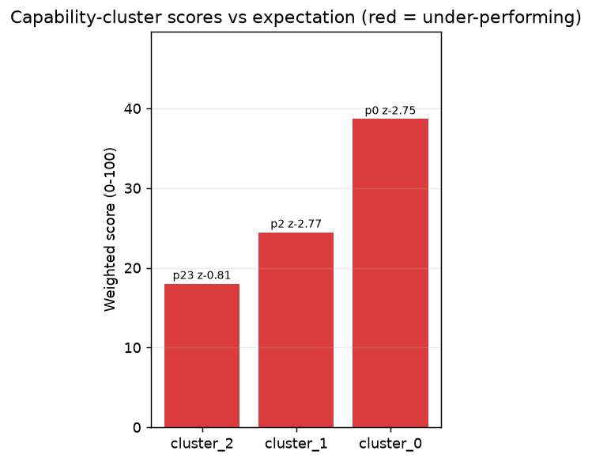
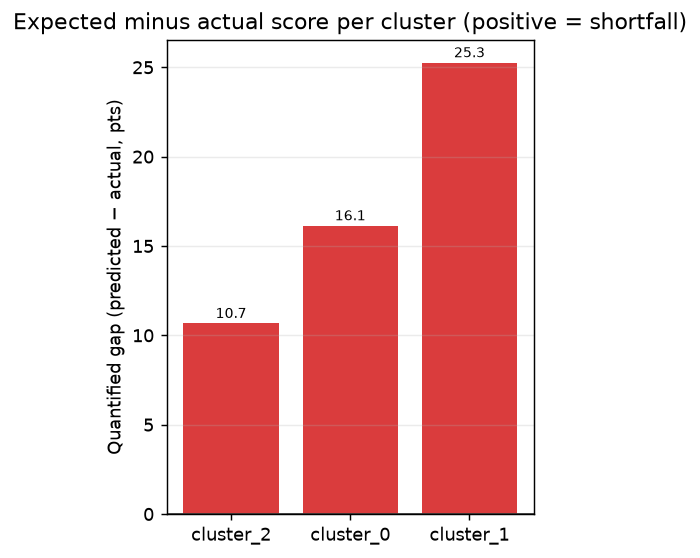

# Benchmark Diagnosis Report — Llama-3-8B

- **model_id**: `llama-3-8b`
- **arch**: dense | total_params: 8.000 | active_params: 8.000
- **generated_at**: 2026-08-17T12:02:51.478610
- **mode**: full | **advisor**: rules
- **asset versions**: coverage=`coverage-20260814084434-3e725b` portfolio=`portfolio-20260814084434-ecae13` curves=`curves-20260814084434-ee521f` experience=`None`

## Summary — 3 capability cluster(s)

| cluster | weighted score | percentile | z-score | verdict |
|---|---|---|---|---|
| `cluster_0` | 38.666 | 0.0 | -2.75 | ⚠️ under-performing |
| `cluster_1` | 24.454 | 1.7 | -2.77 | ⚠️ under-performing |
| `cluster_2` | 18.000 | 23.1 | -0.81 | ⚠️ under-performing |

## Cluster `cluster_0`

### Benchmarks

| benchmark | weight | score |
|---|---|---|
| `longbench_v2` | 0.834 | 38.000 |
| `mmlu_pro` | 0.049 | 50.000 |

- sub_capability: `longbench_v2` · quantified_gap: 0.16

---

## Cluster `cluster_1`

### Benchmarks

| benchmark | weight | score |
|---|---|---|
| `simpleqa` | 0.935 | 24.000 |
| `math` | 0.027 | 40.000 |

- sub_capability: `simpleqa` · quantified_gap: 0.25

---

## Cluster `cluster_2`

### Benchmarks

| benchmark | weight | score |
|---|---|---|
| `swe_bench` | 0.926 | 18.000 |

- sub_capability: `swe_bench` · quantified_gap: 0.11

---

## 诊断

- taxonomy v1 · probe registry v1 · 校准 logs=0

### 候选能力与复测

| capability | screening | mode | probe 状态 | confidence | suggestion_type |
|---|---|---|---|---|---|
| `knowledge.factual` | 0.13 | coarse | CONFIRMED | Medium | targeted_synthesis |
| `knowledge.world` | 0.12 | coarse | CONFIRMED | Medium | targeted_synthesis |
| `reasoning` | 0.12 | coarse | NO_PROBE | Medium | build_probe_first |
| `long_context` | 0.08 | coarse | CONFIRMED | Medium | targeted_synthesis |
| `language.reading` | 0.08 | coarse | CONFIRMED | Medium | targeted_synthesis |
| `code` | 0.05 | coarse | NO_PROBE | Medium | build_probe_first |
| `agent.tool_call` | 0.05 | coarse | PENDING_EVAL | Medium | build_probe_first |

### 排序后的建议（Priority = Confidence × ExpectedGain / Cost）

**训练类建议**（按优先级降序）

- **knowledge.factual** [targeted_synthesis] (confidence=Medium, priority=0.015, gain=0.123)
  - 该能力基本缺失：构造 / 收集针对 knowledge.factual 的高质量训练数据（或引入 更强 teacher 蒸馏），并人工抽检质量后加入训练
  - *evidence*: probe simpleqa: percentile=14.3
- **long_context** [targeted_synthesis] (confidence=Medium, priority=0.008, gain=0.065)
  - 该能力基本缺失：构造 / 收集针对 long_context 的高质量训练数据（或引入 更强 teacher 蒸馏），并人工抽检质量后加入训练
  - *evidence*: probe longbench_v2: percentile=0.0
- **language.reading** [targeted_synthesis] (confidence=Medium, priority=0.008, gain=0.065)
  - 该能力基本缺失：构造 / 收集针对 language.reading 的高质量训练数据（或引入 更强 teacher 蒸馏），并人工抽检质量后加入训练
  - *evidence*: probe mmlu: percentile=6.2
- **knowledge.world** [targeted_synthesis] (confidence=Medium, priority=0.001, gain=0.006)
  - 该能力基本缺失：构造 / 收集针对 knowledge.world 的高质量训练数据（或引入 更强 teacher 蒸馏），并人工抽检质量后加入训练
  - *evidence*: probe mmlu: percentile=6.2

**先建 Probe（不直接给训练建议）**

- **code** [build_probe_first] — 该能力缺少 probe 或 probe 未评测：先建设 / 运行窄口径 probe 集，确认能力缺口后再决定训练动作（code）
- **agent.tool_call** [build_probe_first] — 该能力缺少 probe 或 probe 未评测：先建设 / 运行窄口径 probe 集，确认能力缺口后再决定训练动作（agent.tool_call）
- **reasoning** [build_probe_first] — 该能力缺少 probe 或 probe 未评测：先建设 / 运行窄口径 probe 集，确认能力缺口后再决定训练动作（reasoning）

### Probe 待办

- 待建设 probe 集：`reasoning`, `code`
- 待评测 probe：`agent.tool_call`

## Figures

