# Benchmark Diagnosis — Offline Results

_Generated 2026-08-14 07:13 UTC from seed reference data (approximate public leaderboard values; see `_note` in the seed)._

## Overview

| metric | value |
|---|---|
| models | 38 |
| benchmarks | 12 |
| scores | 307 |
| capability clusters | 2 |
| fitted expectation curves | 48 |

**Asset versions** (every diagnosis report traces back to these):

- `coverage_version`: `coverage-20260814070928-e85362`
- `portfolio_version`: `portfolio-20260814070928-9d83e6`
- `curves_version`: `curves-20260814070928-11ec55`

## Capability-coverage table

| benchmark | cluster | breadth | reliability | saturated | design-goal agreement | tags |
|---|---|---|---|---|---|---|
| `AIME 2024` | `cluster_0` | 0.93 | 0.16 |  | 0.00 | math, reasoning |
| `ARC-Challenge` | `cluster_1` | 0.87 | 0.23 | ⚠️ | 0.00 | commonsense_knowledge, reasoning |
| `GPQA Diamond` | `cluster_0` | 0.91 | 0.18 |  | 0.00 | world_knowledge, reasoning |
| `GSM8K` | `cluster_1` | 0.84 | 0.21 | ⚠️ | 0.00 | math, reasoning |
| `HellaSwag` | `cluster_1` | 0.34 | 0.15 | ⚠️ | 0.00 | commonsense_knowledge, reading_comprehension |
| `HumanEval` | `cluster_1` | 0.98 | 0.19 | ⚠️ | 0.00 | code |
| `HumanEval+` | `cluster_0` | 0.87 | 0.10 |  | 0.00 | code |
| `IFEval` | `cluster_0` | 0.86 | 0.14 |  | 0.00 | instruction_following |
| `LiveCodeBench` | `cluster_0` | 0.91 | 0.19 |  | 0.00 | code, reasoning |
| `MATH` | `cluster_0` | 0.15 | 0.10 |  | 0.00 | math, reasoning |
| `MMLU` | `cluster_1` | 0.92 | 0.23 |  | 0.00 | world_knowledge, reading_comprehension, reasoning |
| `MMLU-Pro` | `cluster_0` | 0.92 | 0.13 |  | 0.00 | world_knowledge, reasoning |

## Representative portfolios

- **cluster_0**: `aime24` (0.98), `math` (0.02), `ifeval` (0.01)
- **cluster_1**: `mmlu` (1.00)

## Figures

### fig_curves_aime24.png

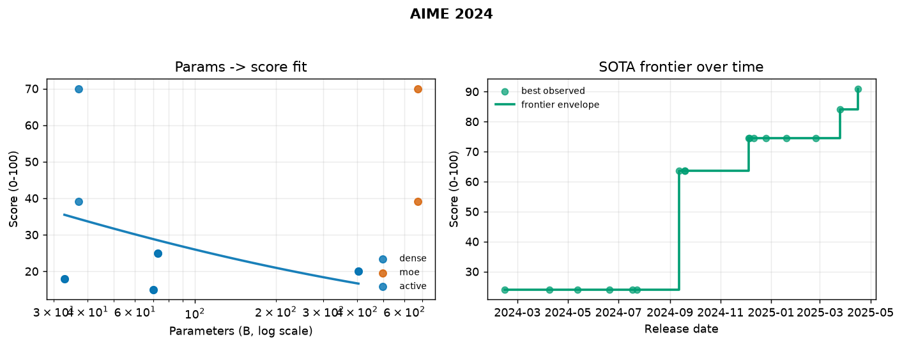

### fig_curves_arc_challenge.png

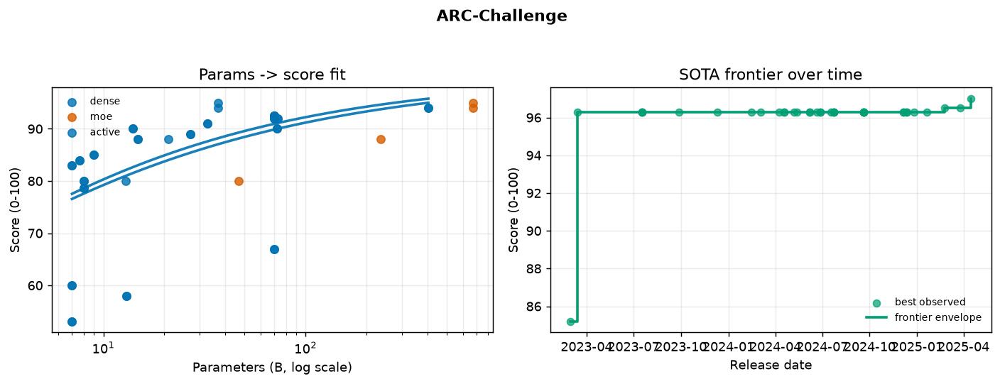

### fig_curves_gpqa.png

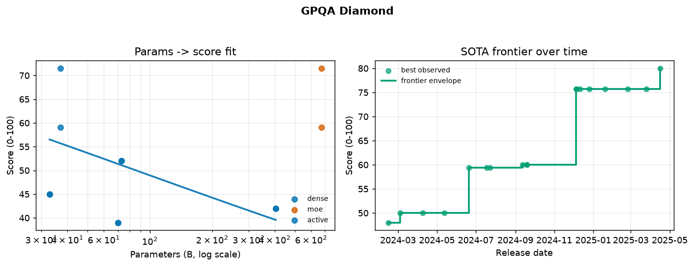

### fig_curves_gsm8k.png

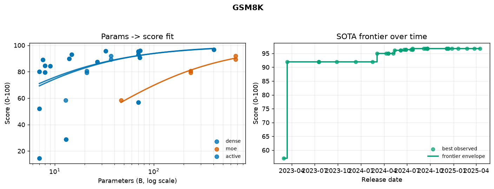

### fig_curves_hellaswag.png

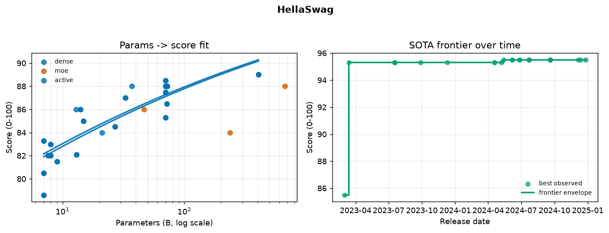

### fig_curves_humaneval.png

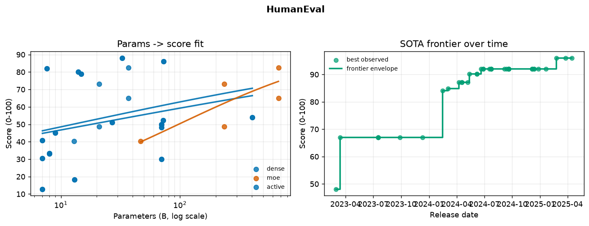

### fig_curves_humaneval_plus.png

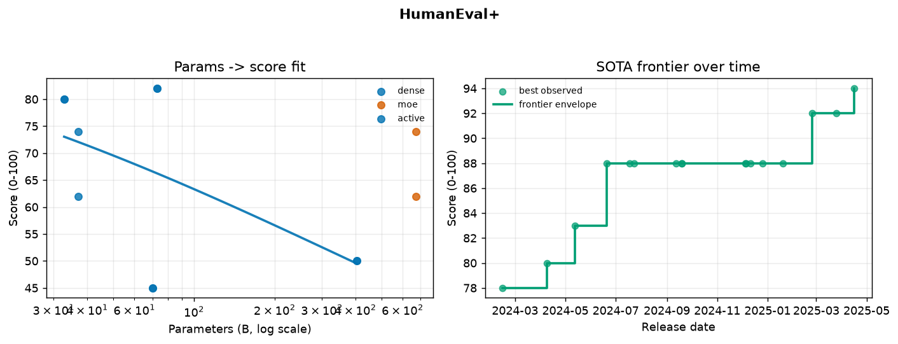

### fig_curves_ifeval.png

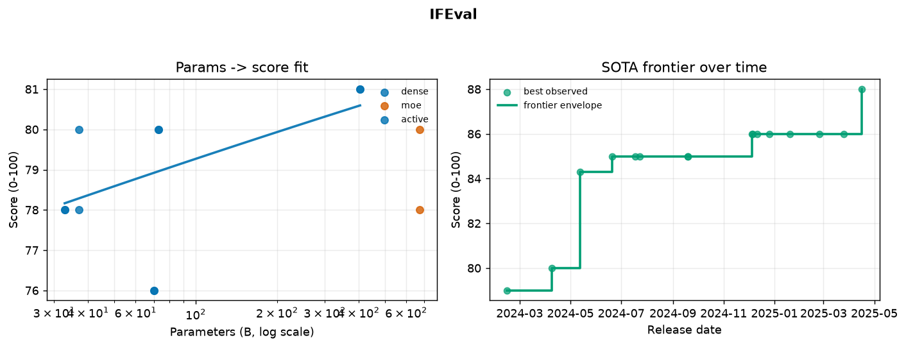

### fig_curves_livecodebench.png

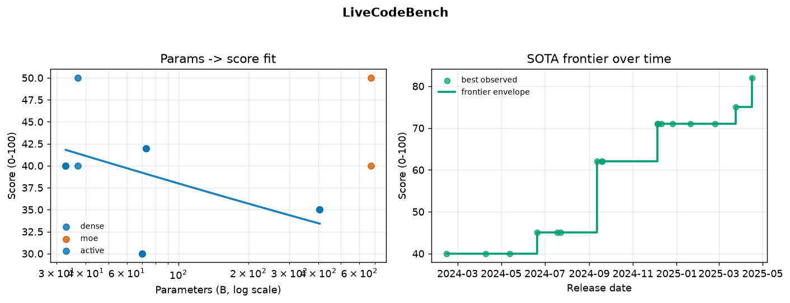

### fig_curves_math.png

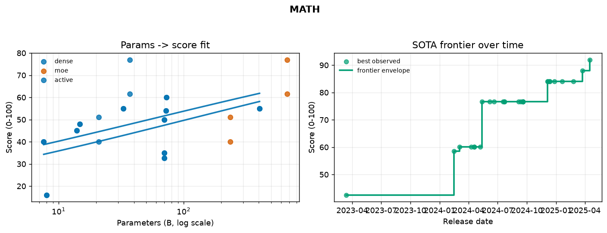

### fig_curves_mmlu.png

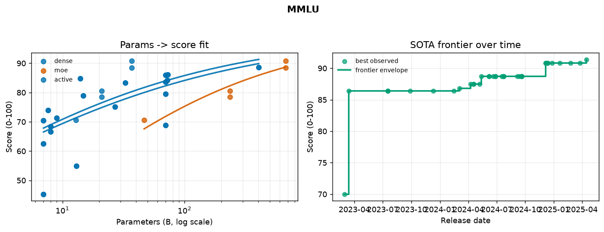

### fig_curves_mmlu_pro.png

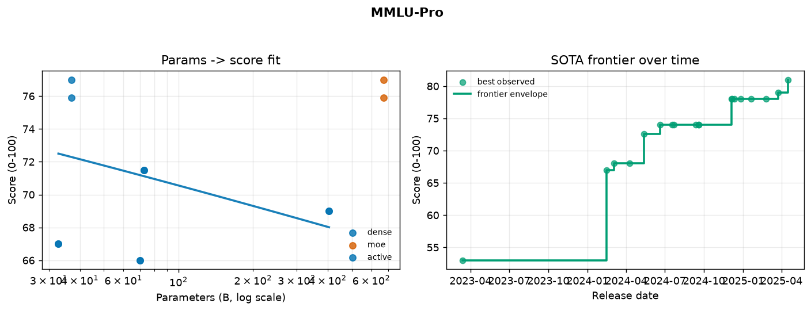

### fig_frontier_overview.png

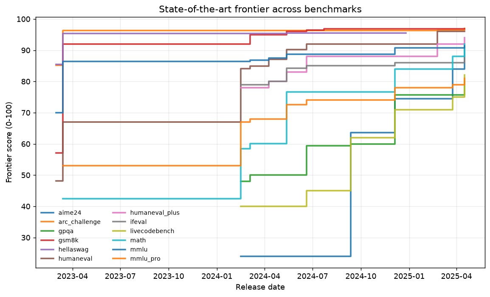

### fig_coverage_profile.png

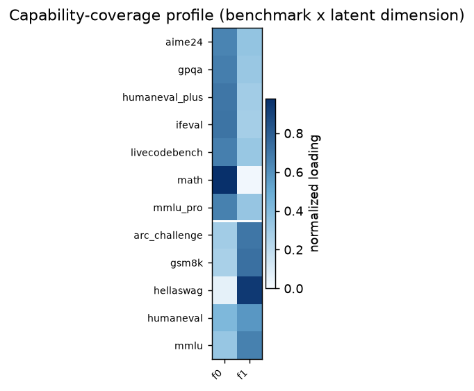

### fig_coverage_metrics.png

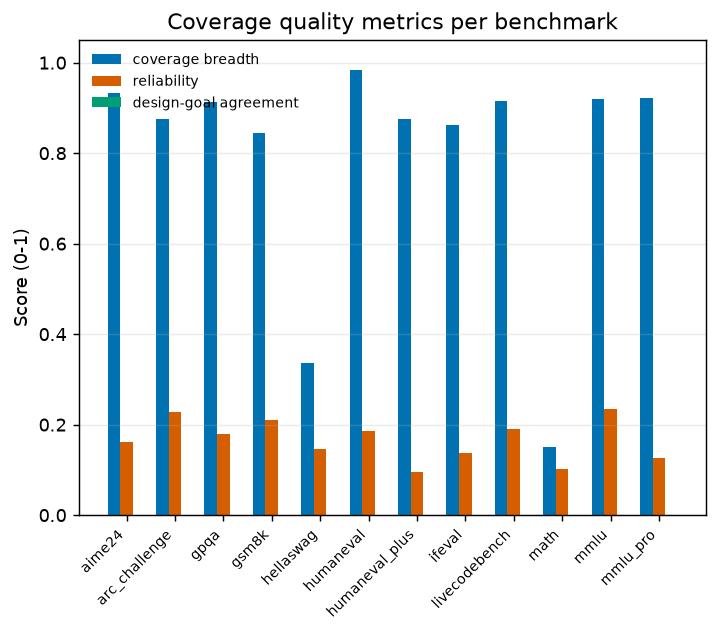

### fig_benchmark_correlation.png

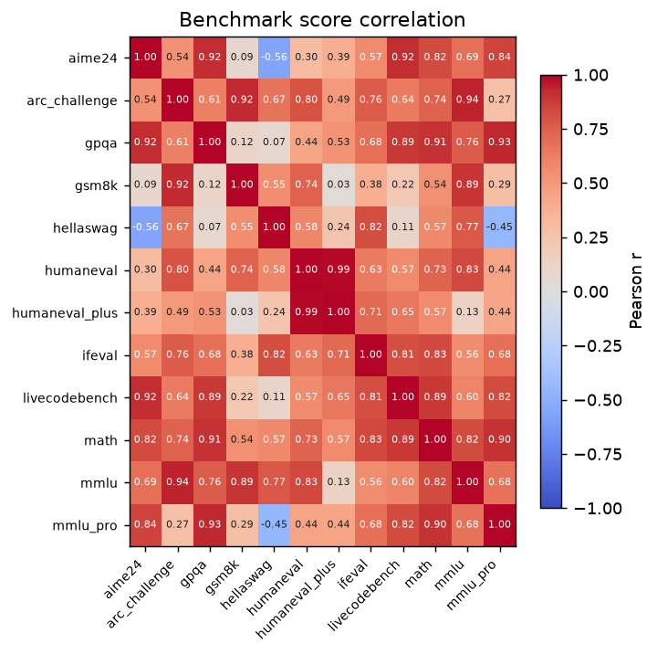
