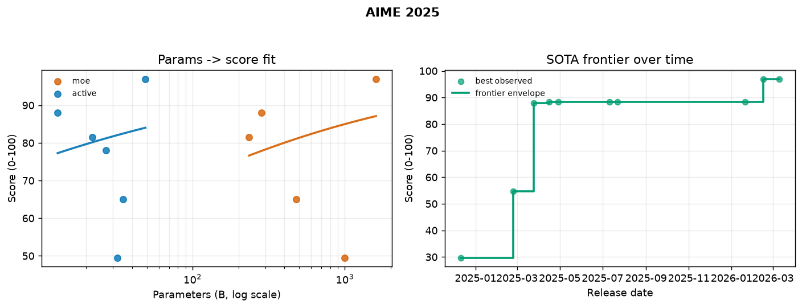
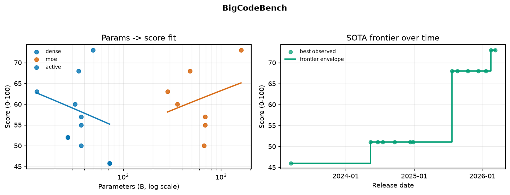
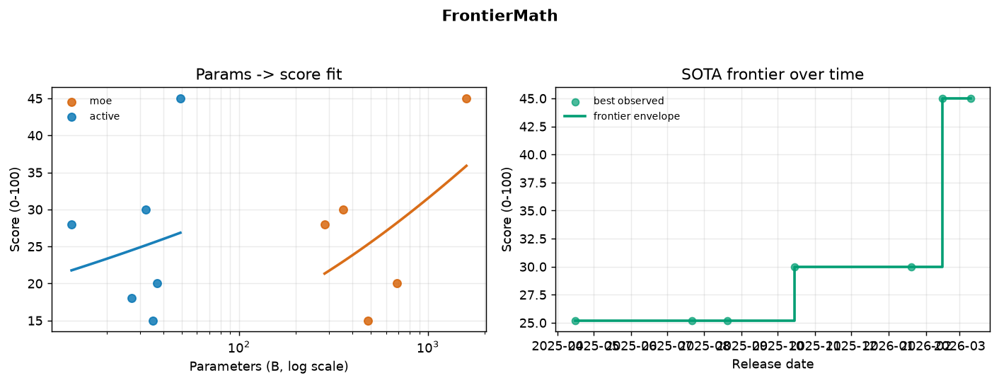
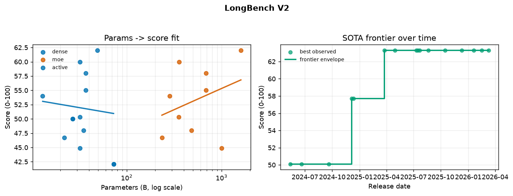
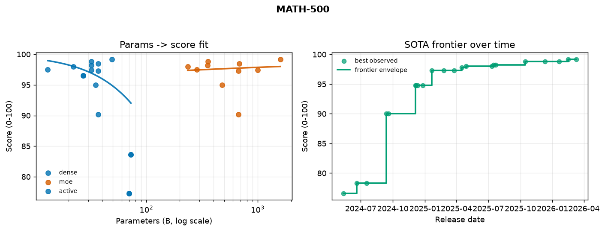
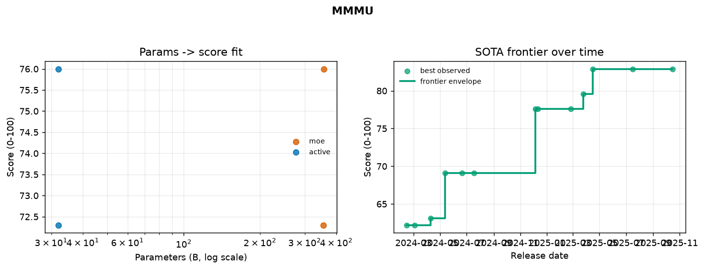
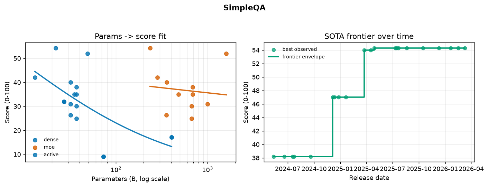
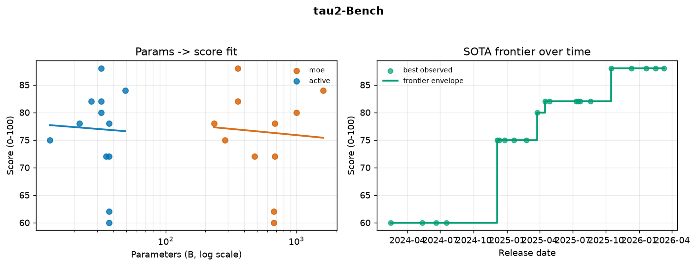
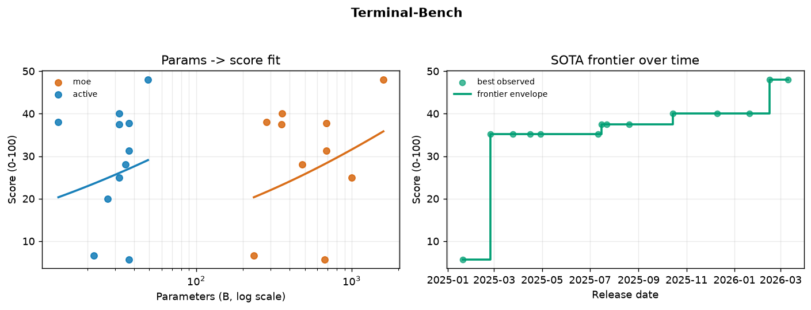

# Benchmark Diagnosis — Offline Results

_Generated 2026-08-14 08:46 UTC from seed reference data (approximate public leaderboard values; see `_note` in the seed)._

## Overview

| metric | value |
|---|---|
| models | 48 |
| benchmarks | 22 |
| scores | 599 |
| capability clusters | 5 |
| fitted expectation curves | 82 |

**Asset versions** (every diagnosis report traces back to these):

- `coverage_version`: `coverage-20260814084434-3e725b`
- `portfolio_version`: `portfolio-20260814084434-ecae13`
- `curves_version`: `curves-20260814084434-ee521f`

## Capability-coverage table

| benchmark | cluster | breadth | reliability | saturated | design-goal agreement | tags |
|---|---|---|---|---|---|---|
| `AIME 2024` | `cluster_0` | 0.71 | 1.00 |  | 0.40 | math, reasoning |
| `AIME 2025` | `cluster_0` | 0.77 | 0.91 | ⚠️ | 0.40 | math, reasoning |
| `ARC-Challenge` | `cluster_1` | 0.59 | 0.99 | ⚠️ | 0.29 | commonsense_knowledge, reasoning |
| `BigCodeBench` | `cluster_2` | 0.86 | 0.94 |  | 0.25 | code |
| `FrontierMath` | `cluster_0` | 0.80 | 1.00 |  | 0.40 | math, reasoning |
| `GPQA Diamond` | `cluster_0` | 0.69 | 0.99 |  | 0.40 | world_knowledge, reasoning |
| `GSM8K` | `cluster_1` | 0.95 | 1.00 | ⚠️ | 0.29 | math, reasoning |
| `HellaSwag` | `cluster_1` | 0.86 | 1.00 | ⚠️ | 0.29 | commonsense_knowledge, reading_comprehension |
| `HumanEval` | `cluster_2` | 0.83 | 1.00 | ⚠️ | 0.25 | code |
| `HumanEval+` | `cluster_2` | 0.91 | 0.98 |  | 0.25 | code |
| `IFEval` | `cluster_1` | 0.66 | 0.90 |  | 0.14 | instruction_following |
| `LiveCodeBench` | `cluster_2` | 0.86 | 0.99 |  | 0.50 | code, reasoning |
| `LongBench V2` | `cluster_0` | 0.83 | 0.84 |  | 0.40 | long_context, reading_comprehension |
| `MATH` | `cluster_1` | 0.40 | 0.99 |  | 0.29 | math, reasoning |
| `MATH-500` | `cluster_0` | 0.62 | 0.85 | ⚠️ | 0.40 | math, reasoning |
| `MMLU` | `cluster_1` | 0.73 | 1.00 |  | 0.43 | world_knowledge, reading_comprehension, reasoning |
| `MMLU-Pro` | `cluster_0` | 0.42 | 0.97 |  | 0.40 | world_knowledge, reasoning |
| `MMMU` | `cluster_4` | 0.85 | 1.00 |  | 1.00 | vision, world_knowledge |
| `SimpleQA` | `cluster_1` | 0.76 | 0.88 |  | 0.14 | factuality |
| `SWE-bench Verified` | `cluster_2` | 0.95 | 1.00 |  | 0.50 | code, agentic_tool_use |
| `tau2-Bench` | `cluster_2` | 0.81 | 0.79 |  | 0.50 | agentic_tool_use, instruction_following |
| `Terminal-Bench` | `cluster_3` | 0.87 | 1.00 |  | 1.00 | code, agentic_tool_use |

## Capability clusters

_Clusters group benchmarks whose scores co-vary across models — i.e. correlated capabilities that tend to improve together during training._

- **cluster_0**: reasoning, math, world_knowledge
- **cluster_1**: reasoning, commonsense_knowledge, math
- **cluster_2**: code, agentic_tool_use, reasoning
- **cluster_3**: code, agentic_tool_use
- **cluster_4**: vision, world_knowledge

## Representative portfolios

- **cluster_0**: `longbench_v2` (0.83), `frontiermath` (0.12), `mmlu_pro` (0.05)
- **cluster_1**: `simpleqa` (0.94), `ifeval` (0.04), `math` (0.03)
- **cluster_2**: `swe_bench` (0.93), `tau2_bench` (0.05), `livecodebench` (0.02)
- **cluster_3**: `terminal_bench` (1.00)
- **cluster_4**: `mmmlu` (1.00)

## Figures

### fig_curves_aime24.png

### fig_curves_aime25.png

### fig_curves_arc_challenge.png

### fig_curves_bigcodebench.png

### fig_curves_frontiermath.png

### fig_curves_gpqa.png

### fig_curves_gsm8k.png

### fig_curves_hellaswag.png

### fig_curves_humaneval.png

### fig_curves_humaneval_plus.png

### fig_curves_ifeval.png

### fig_curves_livecodebench.png

### fig_curves_longbench_v2.png

### fig_curves_math.png

### fig_curves_math_500.png

### fig_curves_mmlu.png

### fig_curves_mmlu_pro.png

### fig_curves_mmmlu.png

### fig_curves_simpleqa.png

### fig_curves_swe_bench.png

### fig_curves_tau2_bench.png

### fig_curves_terminal_bench.png

### fig_frontier_overview.png

### fig_coverage_profile.png

### fig_coverage_metrics.png

### fig_cluster_map.png

### fig_benchmark_correlation.png

